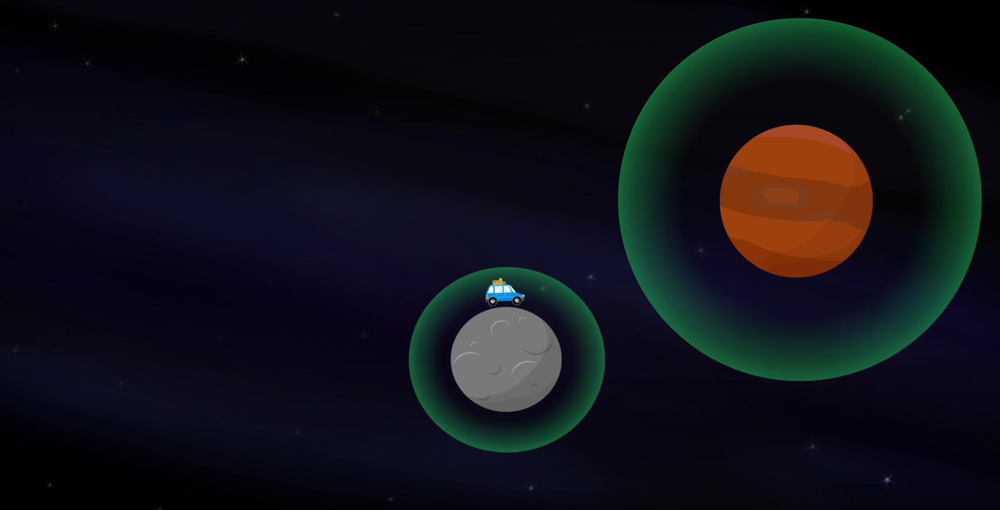

# SPACECAR

SPACECAR is a small physics simulator in which you navigate a car through planet gravitational fields. Currently, we have a proof of concept with a CAR that can travel forward and backward (left and right arrows) and move between two planets.

Eventually, there will be sliders to adjust various aspects of the physics, like CAR weight, and planet mass & gravitational force. This will be a game with multiple levels featuring chains of planets with a final target destination your CAR must reach.

Created for HackPSU 2016 by Will Johannesen & Elizabeth Munz. 